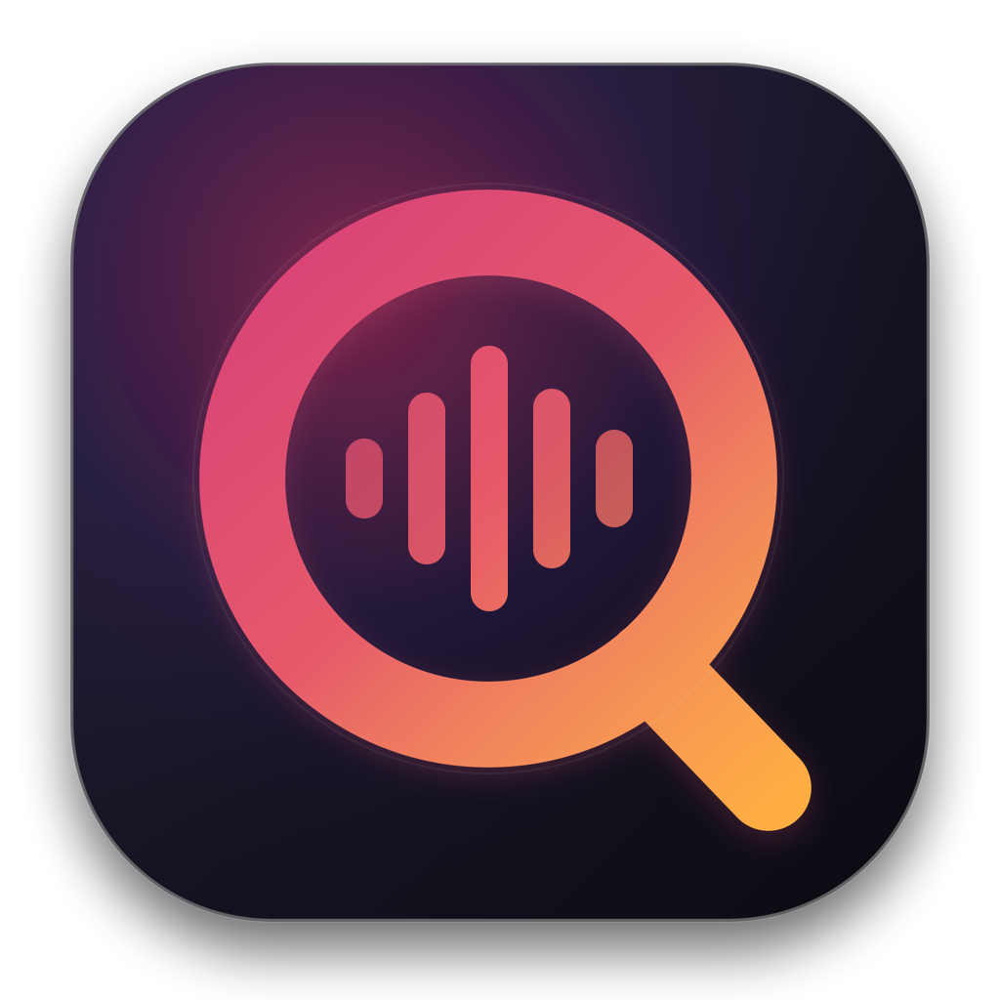
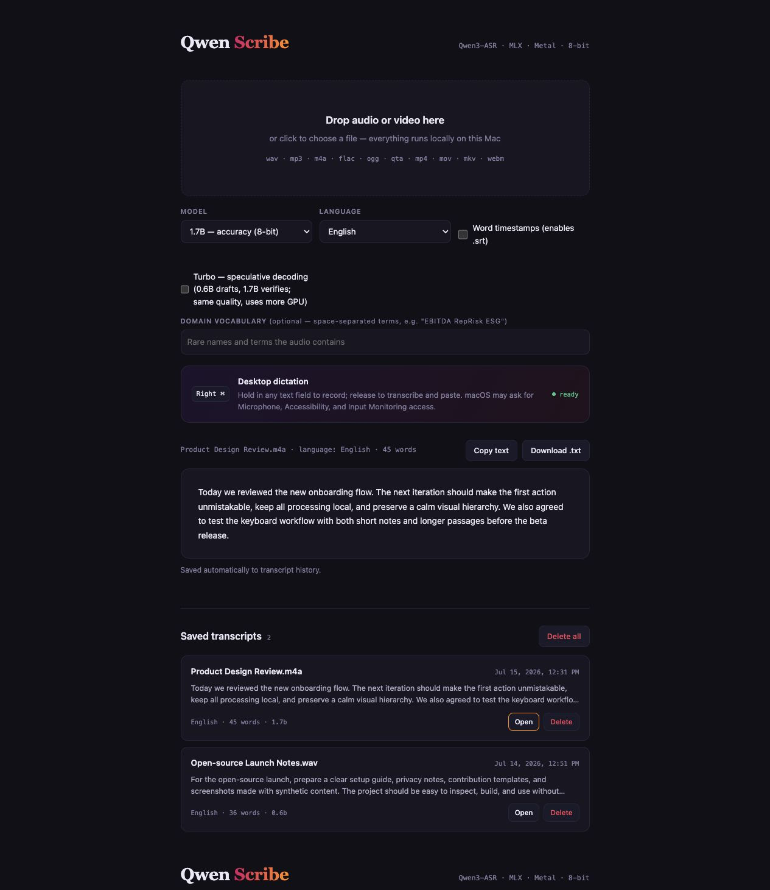
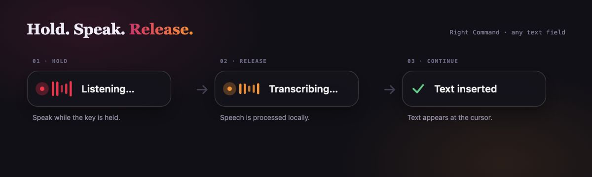

<p align="center">
  
</p>

<h1 align="center">Qwen Scribe</h1>

<p align="center"><strong>Private, local transcription and system-wide dictation for Apple Silicon.</strong></p>

<p align="center">
  <a href="https://github.com/VladUZH/qwen-scribe/actions/workflows/ci.yml"></a>
  <a href="https://github.com/VladUZH/qwen-scribe/releases"></a>
  <a href="LICENSE"></a>
  
  
</p>

Qwen Scribe transcribes audio and video with
[Qwen3-ASR](https://github.com/QwenLM/Qwen3-ASR) running through
[mlx-qwen3-asr](https://github.com/moona3k/mlx-qwen3-asr) on the Mac's Metal
GPU. There is no account, API key, or Qwen Scribe cloud service. Audio and
transcript text stay on the Mac.

> **Project status:** `v0.2.0-beta.1`. Core transcription, history, and
> dictation work. A downloadable beta build exists on the
> [releases page](https://github.com/VladUZH/qwen-scribe/releases); it is
> ad-hoc signed, so macOS blocks the first launch until you approve it under
> **System Settings → Privacy & Security → Open Anyway** — building from
> source with `make app` avoids that hoop. Developer ID-signed and notarized
> binaries follow once credentials are configured
> ([RELEASING.md](RELEASING.md), [ROADMAP.md](ROADMAP.md)). Feedback and
> careful testing are welcome.

<p align="center">
  
</p>

<p align="center"><sub>The interface above uses synthetic demo text; no private recording or transcript is shown.</sub></p>

## Highlights

- Drag-and-drop audio and video transcription in a focused local web interface
- Qwen3-ASR 1.7B for accuracy or 0.6B for speed
- Automatic language detection, optional forced language, vocabulary hints,
  word timestamps, and SRT export
- Automatic local transcript history with search, reopen, export-all,
  individual delete, and delete-all controls
- Hold the configured **push-to-talk key** (right Command by default; right
  Option or right Control if you prefer) in any text field, speak, then
  release to transcribe locally and paste at the cursor
- Menu-bar status item with the dictation state, a push-to-talk key picker,
  and explicit restart and quit controls
- A non-focus-stealing HUD for **Listening**, **Transcribing**, success, and
  failure states
- Localhost-only API with Host and browser-origin checks

<p align="center">
  
</p>

## Requirements

- Apple Silicon Mac
- macOS 14 or newer, as required by current
  [MLX releases](https://ml-explore.github.io/mlx/build/html/install.html)
- Native Python 3.12 or newer, as required by the pinned NumPy in
  [requirements-lock.txt](requirements-lock.txt)
- `ffmpeg` for non-WAV audio and video — Homebrew (`brew install ffmpeg`) or
  MacPorts (`sudo port install ffmpeg`). The Mac app looks on the standard
  Homebrew and MacPorts paths and then on your login shell's `PATH`, so any
  install your terminal can see should work.
- Apple Command Line Tools to build the app from source:
  `xcode-select --install`

The 1.7B model needs roughly 3.4 GB of unified memory and the 0.6B model roughly
1.2 GB, in addition to normal application overhead. Model weights are not
included in this repository.

## Build and run the Mac app

From a downloaded or cloned source directory:

```bash
make app
open "dist/Qwen Scribe.app"
```

The generated app is self-contained except for Python dependencies and model
weights, which it installs or downloads on first use. You may move both apps
from `dist/` to `/Applications` after building:

- `Qwen Scribe.app` starts the server and desktop dictation helper.
- `Stop Qwen Scribe.app` stops only processes started by Qwen Scribe.

An app built locally is ad-hoc signed. If Gatekeeper blocks a downloaded build,
open it once, then approve it under **System Settings → Privacy & Security →
Open Anyway** (macOS 15 removed the right-click **Open** bypass). Stable public binaries should be signed
with an Apple Developer ID and notarized; see [ROADMAP.md](ROADMAP.md).

Server logs are written to `~/Library/Logs/QwenScribe.log`.

### Terminal alternative

```bash
./run.sh
```

Then open <http://127.0.0.1:8990>. The first transcription downloads the
selected model once. Subsequent use works offline once dependencies and weights
are cached.

## Limits and controls

Qwen Scribe is a **menu-bar app plus a local web interface**. The waveform icon
at the right of the menu bar carries Open, Restart Server, and Quit; the browser
page at <http://127.0.0.1:8990> is the interface for file transcription,
history, and settings. Closing the browser tab does not stop anything — quit
from the menu bar (or with `Stop Qwen Scribe.app`). Desktop dictation needs no
browser tab open at all.

| | |
| --- | --- |
| Maximum file size | **4 GB.** The upload is staged in a temporary folder before decoding, so one job briefly needs twice the file's size in free disk space. This is not a model limit — for a longer video, extract the audio track first: `ffmpeg -i input.mp4 -vn -ac 1 -ar 16000 output.wav` |
| Concurrency | One file at a time. Further uploads queue; the Queue list shows the order, and each entry can be cancelled, a failed one retried without re-uploading |
| Languages | Automatic detection, or any of the fourteen Qwen3-ASR supports. Word timestamps for Japanese and Korean use the tokenizers shipped in `requirements-lock.txt`; if the aligner cannot run, the transcript is still produced and saved, without the `.srt` |

## Desktop dictation permissions

Desktop dictation starts with the Mac app. On first launch, allow Qwen Scribe in
**System Settings → Privacy & Security** for:

- **Microphone** — records while the push-to-talk key is held
- **Input Monitoring** — detects that modifier while another app is active
- **Accessibility** — pastes the finished text into the focused field

After changing Input Monitoring or Accessibility, stop and reopen Qwen Scribe.
File transcription remains available when these optional permissions are not
granted.

The helper watches modifier-change events and reacts only to the configured
push-to-talk key (right Command unless you change it in the web interface or
the menu bar). It snapshots the pasteboard in memory, pastes the transcription, and
restores the previous pasteboard if it has not changed. Without Accessibility
access it cannot insert text at all, so it leaves the transcript on the
clipboard and reports the failure instead of claiming success. See
[PRIVACY.md](PRIVACY.md) for the complete data and permission behavior.

## Local files and deletion

| Data | Default location |
| --- | --- |
| Saved transcripts | `~/Library/Application Support/Qwen Scribe/transcripts` |
| Settings | `~/Library/Application Support/Qwen Scribe/settings.json` |
| Private runtime | `~/Library/Application Support/Qwen Scribe/runtime` |
| Diagnostic log | `~/Library/Logs/QwenScribe.log` |
| Downloaded models | `~/.cache/huggingface/hub` |

Saved transcripts are readable, unencrypted JSON. Use the history controls to
delete one or all. Normal filesystem deletion is not secure erasure, and local
backups may retain copies.

### Environment variables

These are read by `server.py`, so they apply to `./run.sh` and to the server the
Mac app starts:

| Variable | Default | Purpose |
| --- | --- | --- |
| `QWEN_SCRIBE_DATA_DIR` | `~/Library/Application Support/Qwen Scribe` | Where transcript history is stored |
| `QWEN_SCRIBE_MODEL_DIR` | `./models` | Where a locally quantized model is looked up |
| `QWEN_SCRIBE_PORT` | `8990` | Port for the local server |

`QWEN_SCRIBE_PORT` only applies when you start the server yourself with
`./run.sh`. The Mac app and the desktop dictation helper both address
`127.0.0.1:8990` directly, so dictation will not find a server on another port.

## Development

```bash
make setup       # create .venv and install the reviewed dependency lock
make test        # run lightweight API/history tests without model weights
make check       # tests, source compilation, and publication hygiene
make app         # build ad-hoc-signed app bundles in dist/
make package     # create a beta release zip in dist/
```

`make app` compiles `native/DictationHelper.m` as the arm64 bundle executable,
embeds the server launcher and tracked sources as signed resources, validates
its property lists, signs it, and verifies the result. Keeping the
privacy-sensitive recorder as the bundle executable gives macOS one stable app
identity for Accessibility, Input Monitoring, and Microphone access. Set
`CODESIGN_IDENTITY` to a Developer ID identity for a release build; notarization
is intentionally a separate release-owner step.

### Optional 8-bit conversion

For source-based use, a local 8-bit conversion can reduce decoding latency:

```bash
source .venv/bin/activate
python quantize_8bit.py
python compare_models.py path/to/representative-recording.m4a
```

This creates a multi-gigabyte `models/` directory that is intentionally ignored
by Git. Validate names and numbers on representative recordings before relying
on a quantized model.

## Architecture

```text
Browser UI ──localhost──> FastAPI job queue ──> MLX / Qwen3-ASR
                                  │
                                  └──> local JSON transcript history

Push-to-talk ──> native macOS helper ──> temporary WAV ──> same job queue
        focused app <── restored clipboard + Command-V <── transcript
```

The API serializes GPU jobs to avoid memory contention. Media is staged under a
random temporary filename and removed when processing finishes.

## Contributing and security

Read [CONTRIBUTING.md](CONTRIBUTING.md) before proposing changes. Please report
vulnerabilities according to [SECURITY.md](SECURITY.md), not in a public issue.
The planned release sequence is documented in [ROADMAP.md](ROADMAP.md).

Project source and issue tracking live at
[VladUZH/qwen-scribe](https://github.com/VladUZH/qwen-scribe).

## License and project identity

Qwen Scribe is licensed under [Apache-2.0](LICENSE). Third-party licenses and
attribution are listed in [THIRD_PARTY_NOTICES.md](THIRD_PARTY_NOTICES.md).

Qwen Scribe is an independent community project. It is not affiliated with,
endorsed by, or sponsored by Alibaba Cloud, the Qwen team, or Apple Inc. Qwen
and other names may be trademarks of their respective owners.
